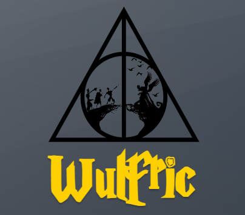

# E-commerce Wulfric

Proyecto Final de React Js
Es una tienda donde se pueden adquirir productos del mundo de Harry Potter, libros, varitas, objetos, etc.

## Librerias utilizadas en el proyecto:

* Firebase: Aloja la base de datos del proyecto, ademas de generar el dinamismo en la navegacion y categorias de productos.
* SweerAlert2: Utilizada para alertar al usuario que complete todos los datos del formulario para poder finalizar la compra, y alertar ademas si el mail ingresado no coincide.

## Funcionalidades:
El usuario podrá:
* Navegar por todos los productos de la tienda.
* Ver los detalles de cada producto: descripción, precio, imagen, etc.
* Si el usuario, por error, ingresa un Id de producto por URL menor a 20 caracteres, se emite un error.
* Ingresar al Carrito en cualquier momento desde el NavBar.
* Agregar items al Carrito, en donde nunca se podrá agregar una cantidad superior al stock disponible de cada item (10 unidades).
* Eliminar items del Carrito.
* A través del formulario, el usuario puede finalizar la compra, siempre y cuando complete todos los datos solicitados y que coincida el mail en su confirmación.
* Al finalizar la compra, el usuario obtendrá su número de orden.
